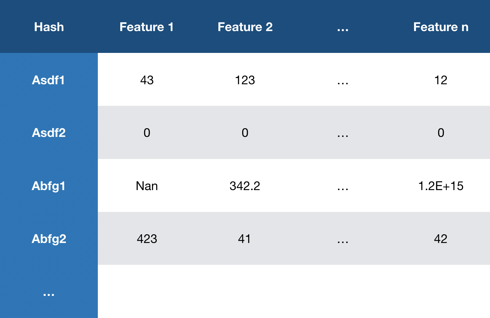
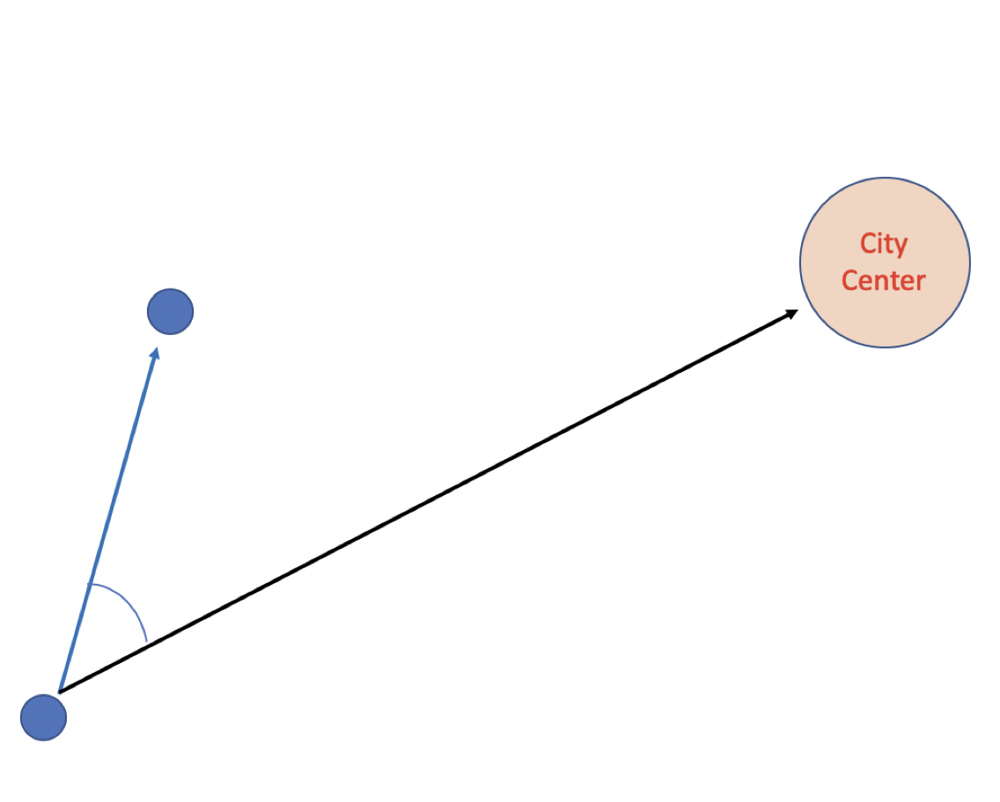
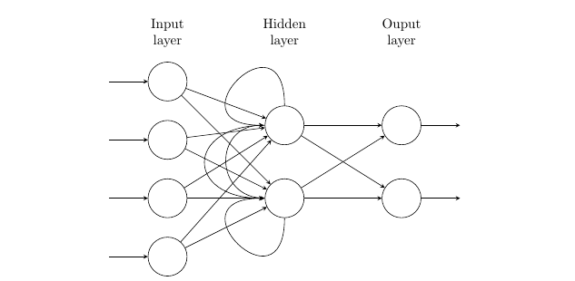
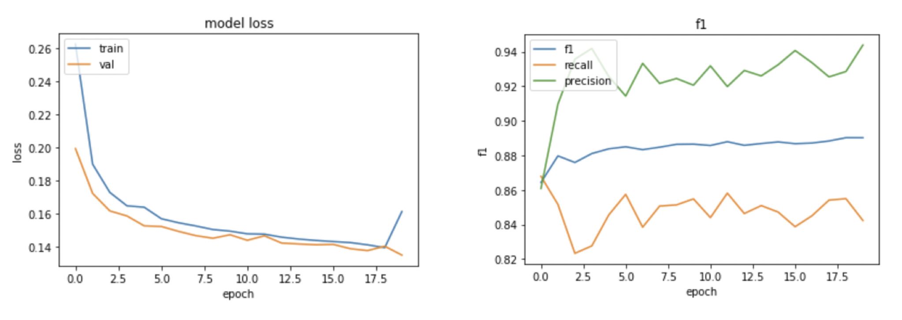

# EY_DataWave_Challenge

## Challenge Description

This was a Data Science Challenge held by Ernest and Young. The objective was to find a way to predict people's end location at a specific time window provided their previous GPS track data.

*This is the repository used by me and my friend to collaborate.*

For challenge details, please take a look at [Challenge Manual](Challenege_Manual.pdf)

## Repository description

Each jupyter notebook is different versions of our source code; code 0~4 are naive approaches, while Grouped by Hash and Time Series ~ files contain more complex ideas.

## Methodology

### Raw data shape

Given the data, grouping the data with the same hash for time series anlaysis seemed promising.

### Feature Engineering and Preprocessing

We relied on insights we had on the situation: 
for example, it is more probable for a person to move toward place A when that person's previous moving directions were headed toward near place A. Therefore, we included the 'bearing' feature.

After that, the features were aggregated and formatted in a way that each steps recorded in one device would be all flattened out in one line: so that they can be interpreted as to predict one exit point. Since all devices have different number of steps recorded, zero padding was added to keep the data in format.
Then using **Scikit-learn**, the features were normalized.

All the data was handled using **Pandas** dataframe, and pased to the prediction model in **Numpy** array format.

### Neural Network Model

Used **Keras** LSTM model, as LSTM has shown advantage over RNN in vanishing/exploding gradient problem, and fits the purpose of time series forecasting very well.

In this project, 64 neurons of LSTM cells and 1 Dense output cell with sigmoid activation was used, since it was a binary categorization problem.

## Results

Through various experimentation and analyzing the learning curve, the best epoch and learning rate were hand-picked. In the end, The code ended up with ~89 accuracy in F1 Score. 
My friend and I participated in the Hong Kong devision, and made it to the country finalist (top 10 in the country). We are proud of the fact that we made it to there, with very little prior experience on machine learning and data science. It was a great opportunity for myself to get hand-on experience on how to implement machine learning theories into code, look into documentations and communities to find specific problems, and though in high-level, self-learn to try newer technologies such as LSTM.
